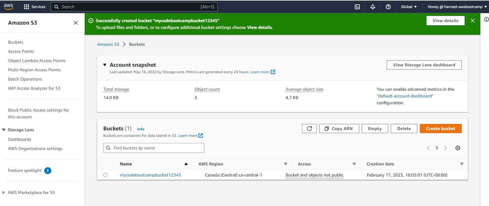
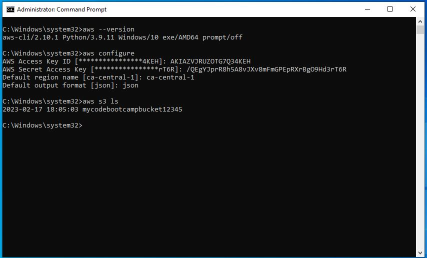
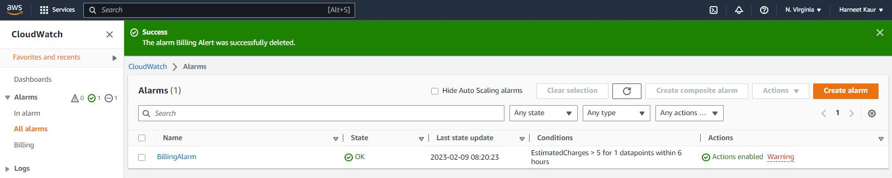
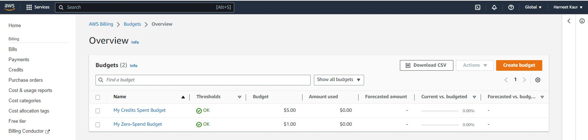

# Week 0 — Billing and Architecture

## Homework for Week 0

### Installing AWS CLI 

I have installed AWS CLI in local environment as I was facing issue installing it using gitpod during my last few steps. Also, I was aware of Installing it locally so I tried following the same steps. 

Steps to Install AWS CLI on Local Machine (Windows) are as follows:

I refer official [Official AWS CLI Installation page](https://docs.aws.amazon.com/cli/latest/userguide/getting-started-install.html)

In oredr to install latest versio of AWS CLI click on this [link](https://awscli.amazonaws.com/AWSCLIV2.msi)


Open Command Prompt on your Local Machine as  an Administrator
To confirm installation type following command 
```
aws --version
```

To confirm AWS Configuration type command
```
aws configure
```
For more clarity, I also Created an S3 bucket in AWS Console with name "mycodebootcampbucket12345" in ca-central-1 region. The proof is attached here:




To visualise this bucket in AWS CLI, I type following command to list all teh buckets in the AWs Management console:
```
aws s3 ls
```

I was able to successfully Configure my credentials using Command Prompt




*** Proof of Billing Alarm Creation




*** Proof of Budgets Creation


