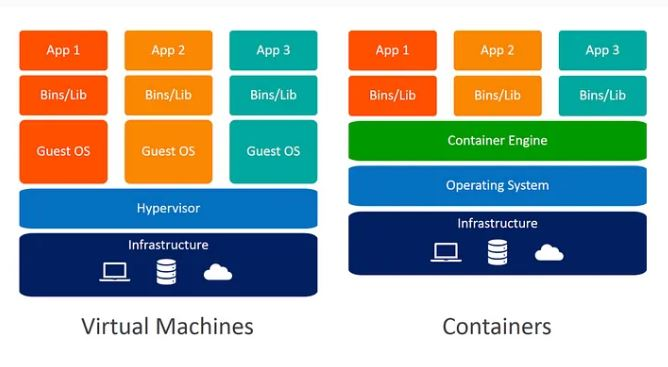
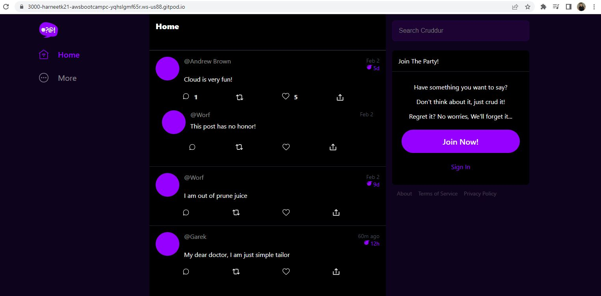
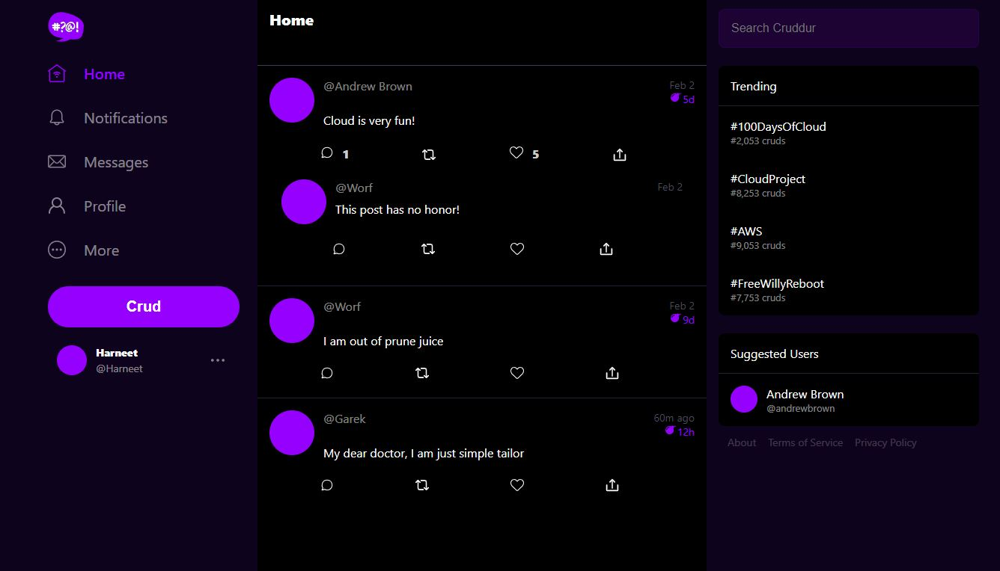

# Week 1 — App Containerization

## Homework for Week 1


### Understanding the difference between Containers and Dockers

I Reserach on internet regarding understanding the difference between containers and Dockers and ultimately got clarification about same. 

Containers: 
- Virtualization of an application instead of Hardware
- Runs on the top of core OS
- Doesn't require dedicated CPU, Memory or Network
- Optimizes infrastructure speed and density

Dockers: 
-Platform for developing, shipping and running applications using Container Technology
-It is a facility to ship your application anywhere.

Also, I got an idea of difference between a Virtual Machine and a Container




### Challenge 1: Dockerize a React front-end app and a Flask back-end app: 

Step 1: Create a Dockerfile in Backend Flask

```
FROM python:3.10-slim-buster

WORKDIR /backend-flask

COPY requirements.txt requirements.txt
RUN pip3 install -r requirements.txt

COPY . .

ENV FLASK_ENV=development

EXPOSE ${PORT}
CMD [ "python3", "-m" , "flask", "run", "--host=0.0.0.0", "--port=4567"]

```

Step 2: Creating Dockerfile for Frontend React app:

```
FROM node:16.18

ENV PORT=3000

COPY . /frontend-react-js
WORKDIR /frontend-react-js
RUN npm install
EXPOSE ${PORT}
CMD ["npm", "start"]

```
Step 3: Run Docker Compose to see the results 





Step 4

