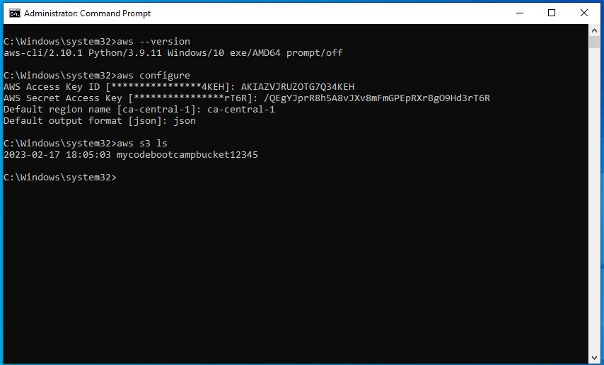

# Week 2 — Distributed Tracing

## Installing AWS CLI on Gitpod

I am starting this week by installing AWS CLI Credentials on gitpod. 
Earlier I installed it on my local machine in week0

 

## Resuming my Work on Week 2

I am watching Live session and started working as per instructions given in the class

### Challenge 1: Instrument our backend flask application to use Open Telemetry (OTEL) with Honeycomb.io as the provider

Instrumenting Honeycomb Keys was quite a challenging task but finally with efforts I am able to successfully configure them

 

### Challenge 2: Run Queries to explore traces within Honeycomb.io

I have successfully created spans in honeycomb.

### Challenge 3: Observe X-Ray traces within the AWS Console

Unfortunately I am not able to Observe X-ray traces witin in AWS Console even after a couple of Tries. I will retry it again till I find solution to it. I found AWS X-Ray console a bit confusing. Maybe this is the reason for not getting desired result.

### Challenge 4: Working with Rollbar to observe an error

Rollbar service works fine for me and I am able to successfully perform error logging.

### Challenge 4: Install WatchTower and write a custom logger to send application log data to - CloudWatch Log group

Though I am able to configure watchtower in Gitpod but still I am facing challenge in writing a custom logger to send my application log data to cloudwatch.
I will try it again.

